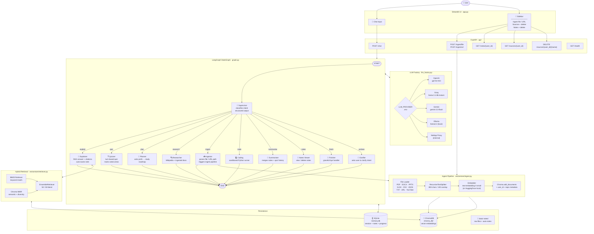

# AI Learning Companion

A personal, multi-agent AI tutor built with LangGraph, FastAPI, and Streamlit.

It ingests your documents (PDF, DOCX, PPTX, Excel, CSV, TXT, URLs, YouTube),
answers questions with cited RAG responses, quizzes you on what you've
learned, tracks your progress across sessions, generates study plans, runs
Python code snippets safely, and can summarise everything you know about a
topic — all through one conversational interface.

---

## Features

- **Explainer** — RAG-backed answers with source citations, personalised to
  your level
- **Quizzer** — turn-based quizzes (configurable question count / difficulty),
  tracks scores and weak areas
- **Planner** — generates a personalised study roadmap based on your progress
- **Researcher** — combines Wikipedia + your own ingested documents
- **Notes** — auto-saves a summary after each explanation; view or delete
  notes anytime
- **Summariser** — "summarise everything I know about X" — consolidates your
  notes + quiz history into one LLM-generated summary
- **Coding** — runs Python snippets in a sandboxed subprocess with safety
  guards
- **Ingest** — add files or links directly through chat, or via the Streamlit
  sidebar
- **Memory** — remembers your profile, progress, and notes across sessions
  (SQLite-backed)
- **Multi-provider LLMs** — switch between OpenAI, Groq, Gemini, Ollama (or an
  internal NetApp proxy) via a single `.env` variable — zero code changes

---

## Architecture

```
Streamlit (UI only)
      │  HTTP requests
      ▼
FastAPI (all business logic)
      │
      ▼
LangGraph StateGraph
      │
      ├─ supervisor (routes intent)
      ├─ explainer / quizzer / planner / researcher
      ├─ ingestor / notes / summariser / coding
      └─ SqliteSaver (session memory) + ChromaDB (vector store)
```

### Full Flow — Mermaid Diagram



---

## Setup

### 1. Clone and enter the project

```bash
cd AI-Learning-companion
```

### 2. Create a virtual environment

```bash
python3 -m venv .venv
source .venv/bin/activate
```

### 3. Install dependencies

```bash
pip install -r requirements.txt
```

### 4. Configure your environment

Copy the example env file and fill in your own values:

```bash
cp .env.example .env
```

At minimum, set:
```
LLM_PROVIDER=openai
OPENAI_API_KEY=sk-...
```

See `.env.example` for all supported providers (OpenAI, Groq, Gemini, Ollama).
No code changes are needed to switch providers or to run this on a different
machine — just edit `.env`.

### 5. Run the backend (FastAPI)

```bash
python3 -m uvicorn api.main:app --reload --port 8000
```

Swagger docs available at `http://localhost:8000/docs`.

### 6. Run the frontend (Streamlit)

In a separate terminal:

```bash
streamlit run app.py
```

Open `http://localhost:8501` in your browser.

---

## Development Guide

### Local Development (recommended for active coding)

Run each service with hot-reload enabled so code changes take effect
immediately without restarting:

**Terminal 1 — FastAPI backend (auto-reloads on save):**
```bash
source .venv/bin/activate
uvicorn api.main:app --reload --port 8000
```

**Terminal 2 — Streamlit frontend (auto-reloads on save):**
```bash
source .venv/bin/activate
streamlit run app.py --server.port 8501
```

| Service | URL | Notes |
|---|---|---|
| Streamlit UI | http://localhost:8501 | Main chat interface |
| FastAPI docs (Swagger) | http://localhost:8000/docs | Interactive API explorer |
| FastAPI docs (ReDoc) | http://localhost:8000/redoc | Alternative docs view |
| Health check | http://localhost:8000/health | Returns `{"status":"ok"}` |

> **Tip:** Keep both terminals visible side-by-side. FastAPI will print
> LangGraph trace logs in Terminal 1; Streamlit render logs appear in Terminal 2.

---

### Adding a New Agent

1. **Create** `agents/my_agent.py` — implement a function
   `my_agent(state: LearningState) -> dict` that returns a partial state update.
2. **Register the intent** in `agents/supervisor.py` — add a new value to the
   `Intent` enum (e.g. `my_agent = "my_agent"`) and a routing description in
   the system prompt.
3. **Wire the node** in `graph.py`:
   ```python
   from agents.my_agent import my_agent
   builder.add_node("my_agent", my_agent)
   builder.add_edge("my_agent", END)
   ```
4. **Add the route** in the `route()` function in `graph.py`:
   ```python
   elif intent == "my_agent":
       return "my_agent"
   ```
5. **Test locally** by typing a message that should trigger the new intent.
   Check the supervisor's structured-output classification in the FastAPI logs.

---

### Switching LLM Providers

Edit `.env` (no code changes needed):

| `.env` setting | Effect |
|---|---|
| `LLM_PROVIDER=openai` | Uses `OPENAI_API_KEY` |
| `LLM_PROVIDER=groq` | Uses `GROQ_API_KEY` (fast, free tier available) |
| `LLM_PROVIDER=gemini` | Uses `GEMINI_API_KEY` |
| `LLM_PROVIDER=ollama` | Uses local Ollama server at `http://localhost:11434` |
| `LLM_PROVIDER=netapp` | Internal NetApp proxy (requires corp VPN + SSL cert) |

Restart the FastAPI server after changing `LLM_PROVIDER`.

---

### Ingesting Documents

**Via chat (any provider):**
```
add data/my-notes.pdf
add https://en.wikipedia.org/wiki/Transformer_(deep_learning_architecture)
add https://www.youtube.com/watch?v=...
```

**Via Streamlit sidebar:** drag and drop files or paste a URL.

**Via API directly:**
```bash
curl -X POST http://localhost:8000/ingest \
  -H "Content-Type: application/json" \
  -d '{"source": "data/my-notes.pdf", "thread_id": "default"}'
```

Supported formats: `.pdf`, `.docx`, `.pptx`, `.xlsx`, `.csv`, `.txt`, URLs, YouTube links.

---

## Docker Build & Deployment

### Build & Run (first time or after code changes)

```bash
docker compose up --build
```

This will:
1. Build a shared Docker image from `Dockerfile` (Python 3.11-slim + all deps)
2. Start the `api` container on port 8000 and wait for the health check to pass
3. Start the `app` container on port 8501 once the API is healthy

### Access Points

| Service | URL |
|---|---|
| **Streamlit UI** | http://localhost:8501 |
| **FastAPI Swagger** | http://localhost:8000/docs |
| **Health endpoint** | http://localhost:8000/health |

### Start Without Rebuilding

```bash
docker compose up
```

Use this for day-to-day starts when you haven't changed `requirements.txt`
or `Dockerfile`.

### Stop Containers

```bash
docker compose down
```

Add `-v` to also remove Docker-managed volumes (not needed here since we use
bind mounts — your local `chroma_db/`, `memory.db`, `notes/`, `data/` are
always preserved).

### View Logs

```bash
# Both services
docker compose logs -f

# API only
docker compose logs -f api

# Streamlit only
docker compose logs -f app
```

### Rebuild a Single Service

```bash
docker compose build api
docker compose up api
```

### Switching Providers in Docker

The container reads `DOCKER_LLM_PROVIDER` from `.env` (defaults to `openai`),
independently of your local `LLM_PROVIDER`. To switch:

```bash
# In .env:
DOCKER_LLM_PROVIDER=groq
GROQ_API_KEY=gsk_...
```

Then restart:
```bash
docker compose up --build
```

### Persistent Data

All data is bind-mounted from your local directory — nothing is lost when
containers restart or are rebuilt:

| Local path | Container path | Contents |
|---|---|---|
| `./chroma_db/` | `/app/chroma_db/` | Vector embeddings |
| `./memory.db` | `/app/memory.db` | Session memory (SQLite) |
| `./notes/` | `/app/notes/` | Auto-saved explanation notes |
| `./data/` | `/app/data/` | Source documents for ingestion |

---

### Production Deployment (basic)

For a production-like setup on a remote server:

1. **Copy the project** to the server (without `.venv/`, `chroma_db/`,
   `memory.db` — those are gitignored):
   ```bash
   git clone <your-repo-url>
   cd AI-Learning-companion
   ```

2. **Create `.env`** on the server with real API keys:
   ```bash
   cp .env.example .env
   nano .env   # fill in OPENAI_API_KEY, DOCKER_LLM_PROVIDER, etc.
   ```

3. **Build and start** in detached mode:
   ```bash
   docker compose up --build -d
   ```

4. **Check status:**
   ```bash
   docker compose ps
   docker compose logs -f
   ```

5. **Update after code changes:**
   ```bash
   git pull
   docker compose up --build -d
   ```

> ⚠️ Before pushing to a public/shared repo, see the **"BEFORE PUSHING"**
> checklist in `plan.txt` to remove or genericise any internal configuration.

---

## Project Structure

```
agents/
  supervisor.py    # Routes each message to the right agent (structured output)
  explainer.py      # RAG answers with citations + auto-saves notes
  quizzer.py         # Turn-based quizzes, tracks scores/weak areas
  planner.py          # Interactive study roadmap (asks weeks/hours, then plans)
  researcher.py        # Wikipedia + ingested docs combined
  ingestor.py           # "add data/file.pdf" — ingest via chat
  coding.py              # Sandboxed Python code execution
  summariser.py           # "summarise everything I know about X"
  knowledge.py             # Empty stub — reserved for Phase 5 (Neo4j, deferred)

api/               # FastAPI app: routers, models, dependencies
vectorstore/       # Document ingestion + hybrid (BM25 + Chroma) retrieval
memory/            # SqliteSaver checkpointer helpers
tools/             # Code runner, search tools

graph.py           # Assembles the LangGraph StateGraph, routes intents
state.py           # LearningState — single source of truth for all data
config.py          # All paths, model names, provider switch
llm_factory.py     # Provider-agnostic LLM/embedding factory
app.py             # Streamlit UI
main.py            # Terminal chat loop (for local testing without the UI)

Dockerfile             # Shared image for both api + app services
docker-compose.yml     # Runs FastAPI + Streamlit together
```

---

## Notes

- All persistent data (`chroma_db/`, `memory.db`, `notes/`, `data/`) lives on
  disk and is gitignored — nothing is lost between restarts.
- `plan.txt` tracks the full build history and roadmap for this project.
- Before sharing or open-sourcing this repo, see the "BEFORE PUSHING TO A
  PUBLIC / SHARED REPO" checklist in `plan.txt` for steps to remove any
  internal/corporate-specific configuration.
